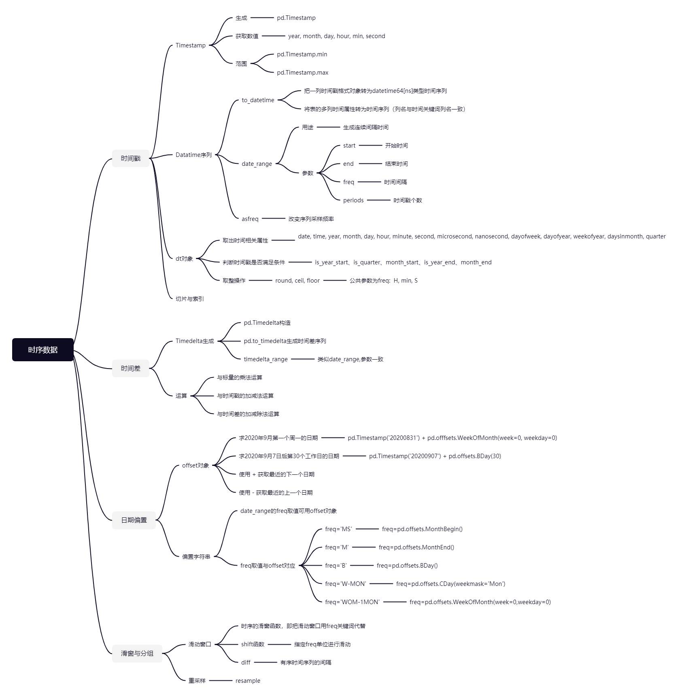

## 1 时间戳Timestamp

### 1.1 Timestamp构造与属性

**pd.Timestamp**

通过year, month, day, hour, min, second可以获取具体的数值

pd.Timestamp.max和pd.Timestamp.min可以获取时间戳表示的范围

### 1.2 Datetime序列的生成

**to_datetime和date_range**

to_datetime

把一列时间戳格式对象转为datetime64[ns]类型时间序列  
把表的多列时间属性拼接转为时间序列,列名必须和时间关键词列名一致

date_range

生成连续间隔时间  
参数:
>start--开始时间  
end--结束时间  
freq--时间间隔  
periods--时间戳个数

### 1.3 dt对象

#### 取出时间相关属性

date, time, year, month, day, hour, minute, second, microsecond, nanosecond, dayofweek, dayofyear, weekofyear, daysinmonth, quarter

#### 判断时间戳是否满足条件

is_year_start、is_quarter、month_start、is_year_end、month_end

#### 取整操作

round, ceil, floor  
公共参数为freq:  H, min, S

## 2 时间差

### 2.1 Timedelta的生成

pd.Timedelta构造

pd.to_timedelta生成时间差序列,或用timedelta_range来生成

### 2.2 Timedelta的运算

与标量的乘法运算、与时间戳的加减法运算、与时间差的加减法与除法运算


```python
import pandas as pd

td1 = pd.Timedelta(days=1)
td2 = pd.Timedelta(days=3)
ts = pd.Timestamp('20200101')
td1 * 2
```


    Timedelta('2 days 00:00:00')


```python
td2 - td1
```


    Timedelta('2 days 00:00:00')


```python
ts + td1
```


    Timestamp('2020-01-02 00:00:00')


时间差的序列运算


```python
td1 = pd.timedelta_range(start='1 days', periods=5)
td2 = pd.timedelta_range(start='12 hours', freq='2H', periods=5)
ts = pd.date_range('20200101', '20200105')
td1 * 5
```


    TimedeltaIndex(['5 days', '10 days', '15 days', '20 days', '25 days'], dtype='timedelta64[ns]', freq='5D')


```python
td1 * pd.Series(list(range(5)))
```


    0    0 days
    1    2 days
    2    6 days
    3   12 days
    4   20 days
    dtype: timedelta64[ns]


```python
td1 + pd.Timestamp('20200101')
```


    DatetimeIndex(['2020-01-02', '2020-01-03', '2020-01-04', '2020-01-05',
                   '2020-01-06'],
                  dtype='datetime64[ns]', freq='D')


## 3 日期偏置

### 3.1  Offset对象

日期偏置是一种和日历相关的特殊时间差

如何求2020年9月第一个周一的日期


```python
pd.Timestamp('20200831') + pd.offsets.WeekOfMonth(week=0,weekday=0)
```


    Timestamp('2020-09-07 00:00:00')


以及如何求2020年9月7日后的第30个工作日是哪一天。


```python
pd.Timestamp('20200907') + pd.offsets.BDay(30)
```


    Timestamp('2020-10-19 00:00:00')


使用+时获取离其最近的下一个日期，当使用-时获取离其最近的上一个日期

### 3.2 偏置字符串

date_range的freq取值可用Offset对象


```python
pd.date_range('20200101','20200331', freq='MS') # 月初
```


    DatetimeIndex(['2020-01-01', '2020-02-01', '2020-03-01'], dtype='datetime64[ns]', freq='MS')


```python
pd.date_range('20200101','20200331', freq=pd.offsets.MonthBegin())  # 和上方取值等价
```


    DatetimeIndex(['2020-01-01', '2020-02-01', '2020-03-01'], dtype='datetime64[ns]', freq='MS')


```python
pd.date_range('20200101','20200331', freq='M') # 月末
```


    DatetimeIndex(['2020-01-31', '2020-02-29', '2020-03-31'], dtype='datetime64[ns]', freq='M')


```python
pd.date_range('20200101','20200331', freq=pd.offsets.MonthEnd())# 和上方取值等价
```


    DatetimeIndex(['2020-01-31', '2020-02-29', '2020-03-31'], dtype='datetime64[ns]', freq='M')


## 4 时序中的滑窗与分组

### 4.1 滑动窗口

时序的滑窗函数，即把滑动窗口用freq关键词代替

shift函数，作用在datetime64为索引的序列上时，可以指定freq单位进行滑动  
diff函数，有序时间序列的间隔

### 4.2 重采样

重采样对象resample，针对时间序列的分组计算
